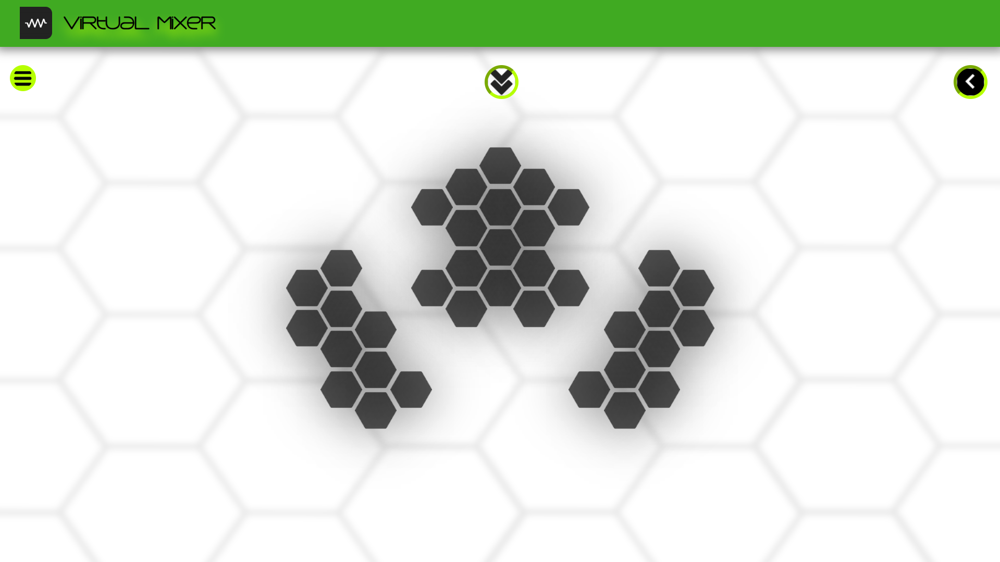
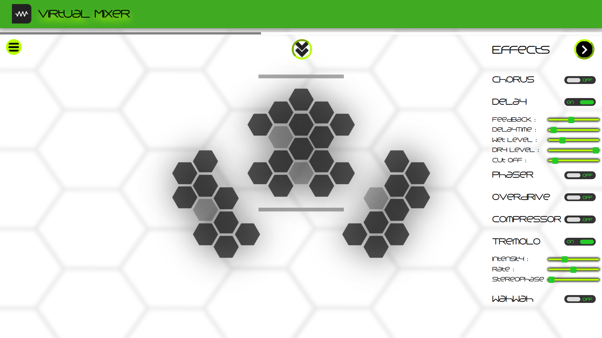
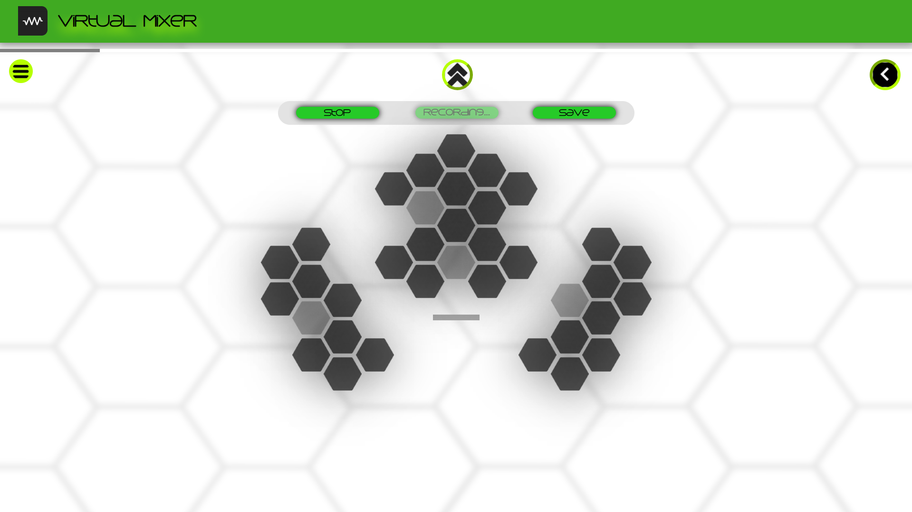
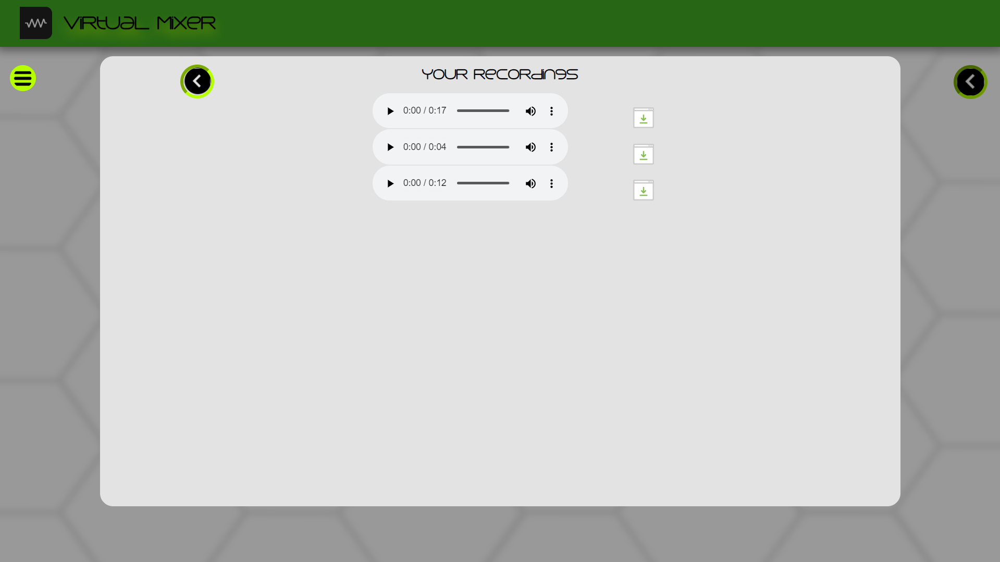

# virtual-mix
A basic online virtual sound mixing webapp

Check it out [here](https://virtual-mix.herokuapp.com/)

Mix, record, download audio on the spot.

  * Create short sound Clips
  * Apply various effects
  * Mix sounds while listening/recording
  * Record
  * Download
  
A total of 36 different sound samples to play with including bass, drums, vocals e.t.c.

Currently supported effects from tuna.js:
  
  * Chorus
  * Delay
  * Phaser
  * Overdrive
  * Compressor
  * Tremolo
  * Wahwah
  * Bitcrusher
  * Moog

